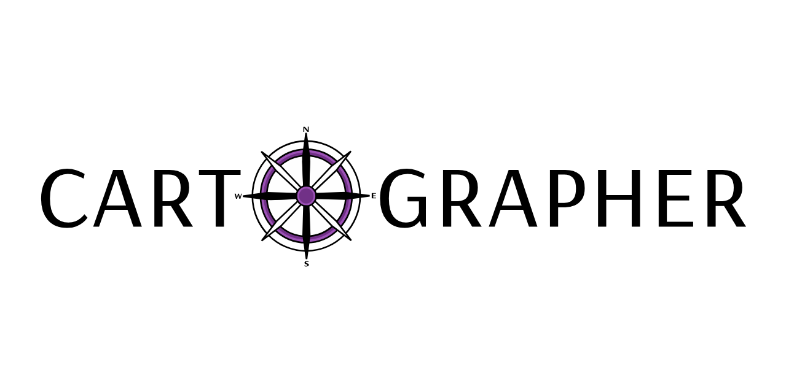

Cartographer is a tool for teams to share URLs and information about their environments and the applications within them.

*This is currently a work in progress!*

## Usage

To make use of cartographer create a config file([Example](example/exampleConfig.yaml)). Update the configuration with Groups, Tags and Links that describe your environment.

| Type | Usage | 
| ---- | ----- |
| Link | A URL and any tags it is related to. |
| Tag | A grouping of related urls |
| Group | A group of related tags |

### K8s

A [helm chart](charts/cartographer/values.yaml)  is provided for running in kuberentes. Keep in mind a persistent volume is required if you plan to add links/tags outside of a gitops flow.

## Developing

See the [TaskFile](Taskfile.yml) for basic steps and required tools.

To run use `task serve` or `./cartographer serve -c example`