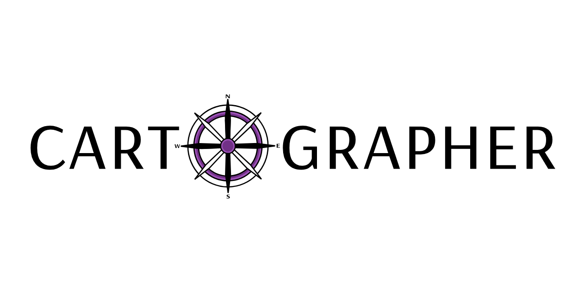
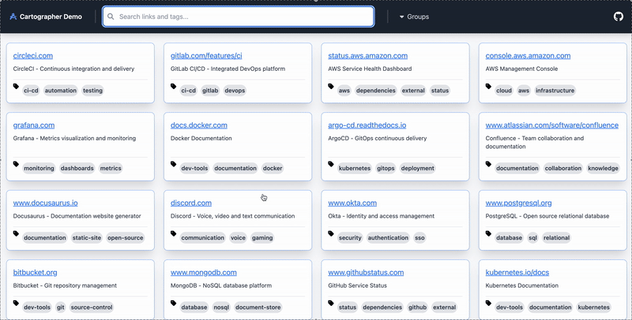

# Cartographer

**A self-hosted note and knowledge base for development teams**

Cartographer helps teams organize, discover, and share notes, links, operational context, and structured data about their environments, applications, and infrastructure. It is built for fast filtering across large collections, with a human-friendly web UI and API access for automation.

*Cartographer is a work in progress and should not be considered stable at this point.*

## What Cartographer Does

Cartographer delivers rapid, searchable access to markdown notes and URL-backed resources through a web interface. Links are treated as notes with an optional URL, so the same search, tags, metadata, and rendering behavior applies to both.



### Features
- Note-first model with markdown bodies, optional URLs, tags, metadata, and structured data.
- Fast search across note titles, bodies, URLs, tags, and structured data.
- Namespace tabs for separating collections of notes.
- Live note creation and editing from the web UI.
- Reusable markdown templates managed from the admin panel.
- Standalone note pages at `/note?id=<note-id>&namespace=<namespace>` for sharing one exact note.
- REST API under `/v1/` and Swagger documentation at `/docs/`.
- Optional MCP server for agent access to a live Cartographer instance.
- Single Go binary with a built-in web UI and backend.

## Getting Started

### Quick Setup

To get a feel for Cartographer, the easiest way is to use Docker Compose. See the [Docker Compose section](#docker-compose) below for detailed instructions.

### Core Concepts

| Type | Description | Example |
| ---- | ----------- | ------- |
| **Note** | Markdown content with optional URL, tags, metadata, and structured data | An incident note, runbook entry, or URL-backed resource |
| **Link** | A note with a URL | `https://staging.myapp.com` with tags `[staging, frontend, api]` |
| **Tag** | A label used to organize related notes | `monitoring`, `staging`, `documentation` |
| **Namespace** | A collection boundary for notes | `default`, `platform`, `production` |
| **Template** | Reusable markdown inserted into new notes | Incident review, meeting notes, deploy checklist |

## Configuration

Cartographer reads YAML config files from `example/` or another supplied config path. Notes can be configured directly:

```yaml
apiVersion: v1beta
namespace: default
notes:
  - id: deploy-checklist
    title: Deploy checklist
    body: |-
      ## Deploy checklist

      - Check dashboards
      - Watch logs
    tags: ["deploy", "runbook"]
    source: "config"
    author: "platform"
```

Legacy `links:` entries are still supported and are normalized into notes.

### Admin Panel

The admin panel is used for operational controls such as markdown templates and namespace deletion. Admin actions require a token.

Configure the token in YAML:

```yaml
cartographer:
  web:
    auth:
      adminToken: "change-me"
```

Or use an environment variable:

```bash
CARTOGRAPHER_ADMIN_TOKEN="change-me" ./cartographer serve -c example
```

## Deployment

### Kubernetes

A [Helm chart](charts/cartographer/values.yaml) is provided for easy Kubernetes deployment.

**Requirements:**
- Persistent volume for data storage (if adding links outside of GitOps flow)
- Ingress controller for external access

### Docker Compose

The easiest way to get started with Cartographer is using Docker Compose:

1. **Start Cartographer:**
   ```bash
   docker-compose up -d
   ```

2. **Access the application:**
   - **Web UI**: http://localhost:8081

3. **Stop the application:**
   ```bash
   docker-compose down
   ```

**Configuration:**
- The example configuration is automatically mounted from `./example/` directory
- To use your own config, replace the volume mount in `docker-compose.yml`

**Ports:**
- `8081` - Web interface (main access point)
- `8080` - gRPC API server

### API Endpoints

Cartographer exposes a REST API under `/v1/` for programmatic access. Interactive API documentation is available via Swagger UI at `/docs/`.

**Swagger Documentation:** http://localhost:8081/docs/

Common endpoints:

- `GET /v1/get` - query notes by namespace, tag, term, or exact ID
- `POST /v1/notes` - create or update a live note
- `GET /v1/get/namespaces` - list namespaces
- `GET /v1/admin/templates` - list reusable markdown templates
- `POST /v1/admin/templates` - create or update templates, admin only

Standalone note pages are available at:

```text
/note?id=<note-id>&namespace=<namespace>
```

### MCP

Cartographer includes an MCP server command for agent access to a live Cartographer instance:

```bash
./cartographer mcp --address 127.0.0.1 --port 8080
```

The MCP server can list namespaces, search notes, fetch exact notes, and add notes.

### Local Development

See the [TaskFile](Taskfile.yml) for development setup and required tools.

**Quick Start:**
```bash
task serve
# or
./cartographer serve -c example
```
