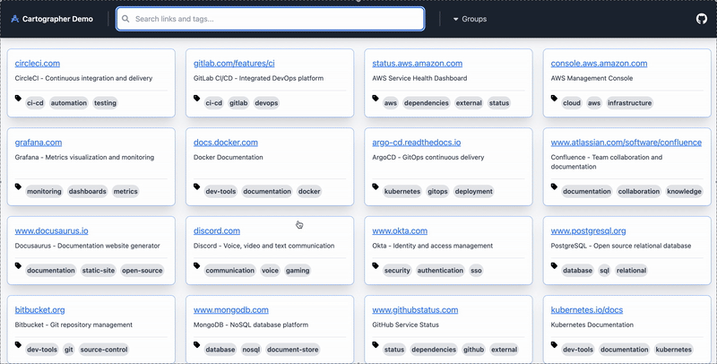

# Cartographer

**A self-hosted note and knowledge base for development teams**

Cartographer helps teams organize, discover, and share notes, links, operational context, and structured data about their environments, applications, and infrastructure. It is built for fast filtering across large collections, with a human-friendly web UI and API access for automation.

*Cartographer is a work in progress and should not be considered stable at this point.*

## What Cartographer Does

Cartographer delivers rapid, searchable access to markdown notes and URL-backed resources through a web interface. Links are treated as notes with an optional URL, so the same search, tags, metadata, and rendering behavior applies to both.



### Features
- Note-first model with markdown bodies, optional URLs, tags, metadata, and structured data.
- Fast search across note titles, bodies, URLs, tags, and structured data.
- Namespace tabs for separating collections of notes.
- Live note creation and editing from the web UI.
- Reusable markdown templates managed from the admin panel.
- Standalone note pages at `/note?id=<note-id>&namespace=<namespace>` for sharing one exact note.
- REST API under `/v1/` and Swagger documentation at `/docs/`.
- Optional MCP server for agent access to a live Cartographer instance.
- Single Go binary with a built-in web UI and backend.

## Getting Started

### Quick Setup

To get a feel for Cartographer, the easiest way is to use Docker Compose. See the [Docker Compose section](#docker-compose) below for detailed instructions.

### Core Concepts

| Type | Description | Example |
| ---- | ----------- | ------- |
| **Note** | Markdown content with optional URL, tags, metadata, and structured data | An incident note, runbook entry, or URL-backed resource |
| **Link** | A note with a URL | `https://staging.myapp.com` with tags `[staging, frontend, api]` |
| **Tag** | A label used to organize related notes | `monitoring`, `staging`, `documentation` |
| **Namespace** | A collection boundary for notes | `default`, `platform`, `production` |
| **Template** | Reusable markdown inserted into new notes | Incident review, meeting notes, deploy checklist |

## Configuration

Cartographer reads YAML config files from `example/` or another supplied config path. Notes can be configured directly:

```yaml
apiVersion: v1beta
namespace: default
notes:
  - id: deploy-checklist
    title: Deploy checklist
    body: |-
      ## Deploy checklist

      - Check dashboards
      - Watch logs
    tags: ["deploy", "runbook"]
    source: "config"
    author: "platform"
```

Legacy `links:` entries are still supported and are normalized into notes.

### Admin Panel

The admin panel is used for operational controls such as markdown templates and namespace deletion. Admin actions require a token.

Configure the token in YAML:

```yaml
cartographer:
  web:
    auth:
      adminToken: "change-me"
```

Or use an environment variable:

```bash
CARTOGRAPHER_ADMIN_TOKEN="change-me" ./cartographer serve -c example
```

## Deployment

### Kubernetes

A [Helm chart](charts/cartographer/values.yaml) is provided for easy Kubernetes deployment.

**Requirements:**
- Persistent volume for data storage (if adding links outside of GitOps flow)
- Ingress controller for external access

### Docker Compose

The easiest way to get started with Cartographer is using Docker Compose:

1. **Start Cartographer:**
   ```bash
   docker-compose up -d
   ```

2. **Access the application:**
   - **Web UI**: http://localhost:8081

3. **Stop the application:**
   ```bash
   docker-compose down
   ```

**Configuration:**
- The example configuration is automatically mounted from `./example/` directory
- To use your own config, replace the volume mount in `docker-compose.yml`

**Ports:**
- `8081` - Web interface (main access point)
- `8080` - gRPC API server

### API Endpoints

Cartographer exposes a REST API under `/v1/` for programmatic access. Interactive API documentation is available via Swagger UI at `/docs/`.

**Swagger Documentation:** http://localhost:8081/docs/

Common endpoints:

- `GET /v1/get` - query notes by namespace, tag, term, or exact ID
- `POST /v1/notes` - create or update a live note
- `GET /v1/get/namespaces` - list namespaces
- `GET /v1/admin/templates` - list reusable markdown templates
- `POST /v1/admin/templates` - create or update templates, admin only
- `GET /v1/admin/export` - download a database archive, admin only
- `POST /v1/admin/import?mode=replace|merge` - restore a database archive, admin only

Standalone note pages are available at:

```text
/note?id=<note-id>&namespace=<namespace>
```

### Database export and import

Export downloads an uncompressed `.tar` archive of the entire database: all
namespaces, notes, reusable admin templates, database metadata, and empty buckets.
The archive contains `manifest.json` (format version and SHA-256 checksum) and
`database.json` (a logical snapshot with base64-encoded database keys and values).
It does not include external configuration files, environment variables, or admin
session cookies. Keep those separately when moving to another instance.

Both endpoints require an admin session. Configure `CARTOGRAPHER_ADMIN_TOKEN` on
the server, then log in and save the session cookie locally:

```bash
export CARTOGRAPHER_URL="http://localhost:8081"
# Enter the same token configured on the server.
read -r -s -p "Admin token: " CARTOGRAPHER_ADMIN_TOKEN; echo
export CARTOGRAPHER_ADMIN_TOKEN
umask 077
python3 -c 'import json, os; print(json.dumps({"token": os.environ["CARTOGRAPHER_ADMIN_TOKEN"]}))' | \
  curl --fail-with-body --silent --show-error \
    -c cartographer.cookies \
    -H 'Content-Type: application/json' \
    --data-binary @- "$CARTOGRAPHER_URL/v1/admin/session"
```

Export the database:

```bash
curl --fail --silent --show-error \
  -b cartographer.cookies \
  --output cartographer.tar \
  "$CARTOGRAPHER_URL/v1/admin/export"
```

Import requires an explicit mode; there is no default:

| Mode | Records present in both databases | Archive-only records | Current database-only records |
| --- | --- | --- | --- |
| `replace` | Use the archived record | Add | Delete |
| `merge` | Keep the current record | Add | Keep |

Records match by **namespace and key**. The same key in different namespaces is
not a conflict. These rules also apply to admin templates. Import preserves whole
records, including timestamps, versions, and tags; it does not combine fields,
choose the newest version, or rerun automatic tagging. Replace restores database
metadata and bucket sequences; merge preserves existing metadata and sequences
and adds missing entries.

Replace the current database with the archive:

```bash
curl --fail-with-body --silent --show-error \
  -b cartographer.cookies \
  -F 'file=@cartographer.tar;type=application/x-tar' \
  "$CARTOGRAPHER_URL/v1/admin/import?mode=replace"
```

Or merge missing records into the current database:

```bash
curl --fail-with-body --silent --show-error \
  -b cartographer.cookies \
  -F 'file=@cartographer.tar;type=application/x-tar' \
  "$CARTOGRAPHER_URL/v1/admin/import?mode=merge"
```

To import into a different instance, change `CARTOGRAPHER_URL` and log in to that
instance first. A successful import returns JSON such as
`{"mode":"merge","added":12,"skipped":3}`. Counts cover stored records, including
templates, but exclude metadata and buckets. In replace mode, `added` counts all
restored records and `skipped` is zero.

Archives are limited to **256 MiB**, with an additional 1 MiB allowed for multipart
upload overhead. Export fails if the generated archive would exceed that limit.
Only the supported archive format and database schema are accepted. Validation
and cache/search preparation failures leave the existing database unchanged.
Import commits atomically; reads and writes wait while the database and derived
state are rebuilt and switched. Restored content is available immediately,
without restarting the server. A subsequent restart still reapplies notes from
the server's configuration files, as it normally does.

Errors return JSON: `400` for invalid modes, uploads or archives, `401` for missing
admin authentication, `413` for oversized uploads, and `500` for storage or export
failures. Interactive documentation is available at `/docs/` (log in through the
admin panel on the same origin to use the authenticated endpoints).

When finished, remove the local session cookie:

```bash
rm cartographer.cookies
unset CARTOGRAPHER_ADMIN_TOKEN
```

### MCP

Cartographer includes an MCP server command for agent access to a live Cartographer instance:

```bash
./cartographer mcp --address 127.0.0.1 --port 8080
```

The MCP server can list namespaces, search notes, fetch exact notes, and add notes.

### Local Development

See the [TaskFile](Taskfile.yml) for development setup and required tools.

**Quick Start:**
```bash
task serve
# or
./cartographer serve -c example
```
