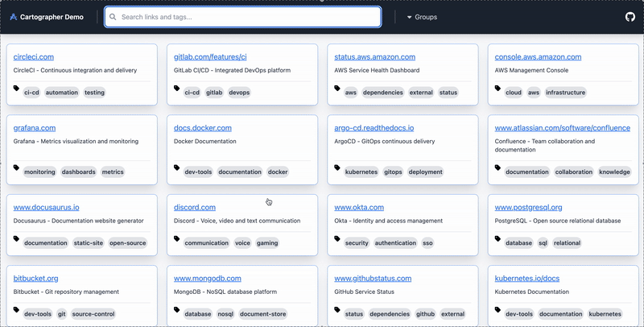

# Cartographer

**A modern, self-hosted bookmark manager and knowledge base for development teams**

Cartographer is a powerful tool designed to help teams organize, discover, and share URLs and information about their environments, applications, and infrastructure. Think of it as a specialized bookmark manager built specifically for developers, DevOps engineers, and technical teams who need to manage a large number of unique URLs.

*Cartographer a work in progress and should not be considered stable at this point!*

## What Cartographer Does

"Cartographer delivers rapid, searchable access to extensive link collections through an intuitive web interface, enabling users to locate their target resources within seconds."



### Features
- **🔗 Centralized Link Management** - Store and organize URLs with rich metadata, descriptions, and custom data fields
- **🏷️ Smart Tagging System** - Categorize links with flexible tags and hierarchical groups for easy discovery
- **🔍 Powerful Search** - Full-text search across URLs, descriptions, and tags with real-time filtering
- **👥 Team Collaboration** - Centrally share knowledge and resources across your entire team
- **🚀 Self-Hosted** - Cartographer is an all in one binary with built in backend. It can be trivially deployed with Docker or Kubernetes
- **⚡ Fast & Lightweight** - Built with Go and modern web technologies for optimal performance.
- **🔌 REST API** - REST API under `/v1/` for programmatic access and integration

## Getting Started

### Quick Setup

To get a feel for cartographer the easiest way is to use docker-compose. See the [Docker Compose section](#docker-compose) below for detailed instructions.

### Core Concepts

| Type | Description | Example |
| ---- | ----------- | ------- |
| **Link** | A URL with metadata, description, and associated tags | `https://staging.myapp.com` with tags `[staging, frontend, api]` |
| **Tag** | A label that groups related links together | `monitoring`, `staging`, `documentation` |
| **Group** | A collection of related tags for hierarchical organization | `Development` group containing `[staging, testing, docs]` tags |

## Deployment

### Kubernetes

A [Helm chart](charts/cartographer/values.yaml) is provided for easy Kubernetes deployment. 

**Requirements:**
- Persistent volume for data storage (if adding links outside of GitOps flow)
- Ingress controller for external access

### Docker Compose

The easiest way to get started with Cartographer is using Docker Compose:

1. **Start Cartographer:**
   ```bash
   docker-compose up -d
   ```

2. **Access the application:**
   - **Web UI**: http://localhost:8081

3. **Stop the application:**
   ```bash
   docker-compose down
   ```

**Configuration:**
- The example configuration is automatically mounted from `./example/` directory
- To use your own config, replace the volume mount in `docker-compose.yml`

**Ports:**
- `8081` - Web interface (main access point)
- `8080` - gRPC API server

### API Endpoints

Cartographer exposes a REST API under `/v1/` for programmatic access. Interactive API documentation is available via Swagger UI at `/docs/`.

**Swagger Documentation:** http://localhost:8081/docs/

### Local Development

See the [TaskFile](Taskfile.yml) for development setup and required tools.

**Quick Start:**
```bash
task serve
# or
./cartographer serve -c example
```