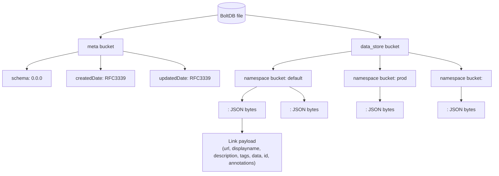

# Backend Data Structure

Cartographer persists backend state in a single bbolt file with a small metadata bucket and a namespace-partitioned data bucket.



## Backend DB interface definition

The backend storage layer is consumed through the `Backend` interface in `pkg/types/backend/backend.go`.

```go
type Backend interface {
    Add(r *BackendAddRequest) *BackendResponse
    Delete(r *proto.CartographerDeleteRequest) *proto.CartographerDeleteResponse
    Get(r *BackendRequest) *BackendResponse
    GetNamespaces() *BackendResponse
    GetAllValues() *BackendResponse
    Close() error
}
```

### Interface-to-storage mapping

- `Add`: writes JSON-encoded objects into `data_store/<namespace>/<id>`.
- `Get`: reads specific IDs from a namespace bucket.
- `GetNamespaces`: lists namespace buckets under `data_store`.
- `GetAllValues`: recursively reads every leaf value from all namespaces.
- `Delete`: removes IDs from a namespace bucket.
- `Close`: closes the underlying bbolt file handle.

## How to read the diagram

- `meta` stores schema/versioning timestamps for the backend file.
- `data_store` is the root for all user data.
- each namespace is a nested bucket under `data_store`.
- each key in a namespace bucket stores one JSON-encoded entity by ID.
- JSON payloads represent `Link` objects served through the API.
