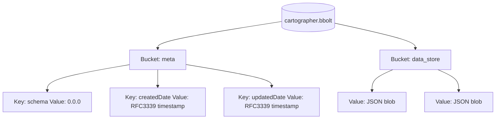

# BoltDB Backend

This backend stores Cartographer records in a single bbolt database file (path supplied via `BoltDBBackendOptions.Path`). All payloads are JSON-serialized before being written.

## Layout

- `meta` bucket: holds backend bookkeeping keys `schema`, `createdDate`, and `updatedDate`.
- `data_store` bucket: holds application data, keyed by resource ID (link ID, tag ID, etc.) with the JSON bytes as the value.

## Notes

- `Add` marshals incoming data to JSON and writes each `key -> []byte` entry to `data_store`.
- `Get` and `GetAllValues` read raw bytes; callers are responsible for deserializing to concrete types.
- `Delete` removes specific keys from `data_store`; errors are returned per ID if missing.
- `Clear` drops the `data_store` bucket; metadata is left intact.
